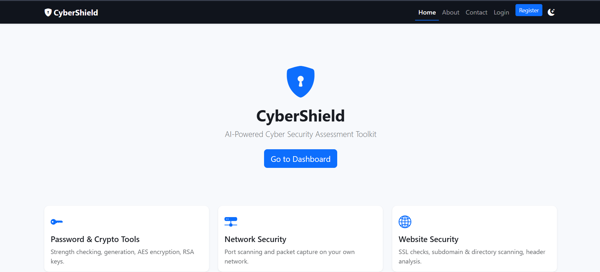
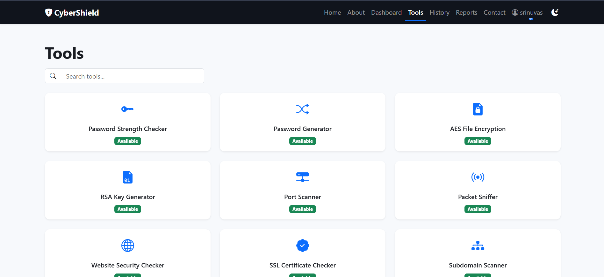
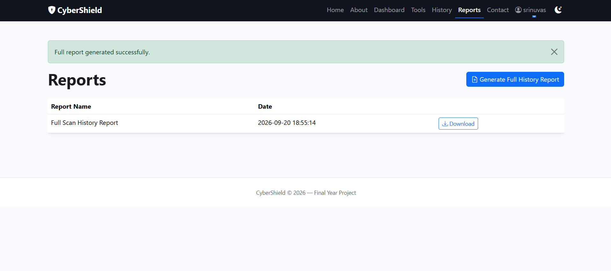

# CyberShield – AI-Powered Cyber Security Assessment Toolkit

CyberShield is a cybersecurity assessment toolkit designed to help users perform various security checks and identify common security weaknesses through a web-based interface.

## Features

- Port Scanner
- Network Scanner
- Website Security Checker
- SSL/TLS Checker
- Subdomain Scanner
- XSS Scanner
- SQL Injection Detector
- Password Strength Checker
- Password Generator
- RSA Key Generator
- Packet Sniffer
- Directory Scanner
- Security Reports
- User Authentication

## Technologies Used

- Python
- Flask
- HTML5
- CSS3
- JavaScript
- SQLite
- Networking and Cybersecurity Tools

## Project Structure

```text
CyberShield/
├── app.py
├── requirements.txt
├── templates/
├── static/
├── utils/
└── README.md
## Screenshots

### Home Page


### Dashboard


### Tools


### Port Scanner


### Website Security Checker


### SSL Certificate Checker


### Scan History


### Reports


### Login Page


